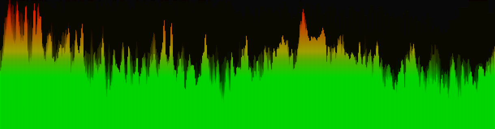

# Audio Visualizer

## Web Audio API

오디오파일을 시각화하기 위해서는 오디오 파일의 주파수를 분석해야 한다.  
즉, 오디오 파일의 데이터에 대해 푸리에 변환이 필요하다.  
Web Audio API에서는 고속 푸리에 변환을 지원해서, Web Audio API를 사용하도록 하자.

## Canvas API

화면에 그리는건 Canvas API 로 처리하자.

## 기본 설정하기

튜토리얼을 따라 기본설정을 해 주자.

````typescript
  function onChangeAudio(e: BaseSyntheticEvent) {
    if (!audioRef.current) return;

    let audio = e.target.files[0];
    audioRef.current.src = URL.createObjectURL(audio);

    // Audio Context 생성
    audioContext.current = new AudioContext();

    // Audio Element와 Audio Context 연결, MediaElementAudioSourceNode 생성
    let source = audioContext.current.createMediaElementSource(
      audioRef.current,
    );

    // Analyser 생성
    analyser.current = audioContext.current.createAnalyser();

    // MediaElementAudioSourceNode에 Analyser 연결
    source.connect(analyser.current);

    // Analyser 에 MediaElementAudioSourceNode 연결
    analyser.current.connect(audioContext.current.destination);

    // fftSize 설정
    analyser.current.fftSize = 4096;

    // 푸리에 변환 데이터 들어갈 배열 초기화
    arr.current = new Uint8Array(analyser.current.frequencyBinCount);
  }```
````

- FFT Size


FFT 속도와 품질은 FFT Size와 샘플링 주파수에 의해 결정된다.

FFT Size를 S, 샘플링 주파수를 F라 하면

```
시간 분해능 = S / F
주파수 분해능 = F / S = 1 / 시간 분해능
```

서로 역수이기 때문에 S에 따라 Trade-Off가 발생한다.  
 FFT Size가 커질수록 더 세밀하게 샘플링하게 된다.  
 적당한 값으로 설정하자.

## Drawing

getByteFrequencyData 를 호출하면 넘겨준 배열에 데이터가 담겨진다.

- requestAnimationFrame  
  Event Loop 는 필요시 화면 주사율에 따라 렌더링 파이프라인 과정을 수행해 끊김이 없음을 보증해주려 노력한다.

  requestAnimationFrame는 리페인트 바로 전에 호출될 함수를 호출하도록 요청하는 함수이다.

```typescript
function renderFrame() {
  if (isPlaying.current) requestAnimationFrame(renderFrame);

  analyser.current!.getByteFrequencyData(arr.current);

  console.log(arr.current);

  contextRef.current!.beginPath();

  for (let i = 0; i < arr.current.length; i++) {}

  contextRef.current?.stroke();
}
```

콘솔의 로그를 보면 다음과 같이 데이터가 들어있는것을 볼 수 있다.


renderFrame 함수를 완성 해 보자.

```typescript
for (let i = 0; i < arr.current.length; i++) {
  contextRef.current?.lineTo((i / arr.current.length) * WIDTH, arr.current[i]);
}
```

순차적으로 뿌려주면 다음과 같은 결과를 얻는다.  
위에서부터 내려오는게 아니라 밑에서부터 올라오도록 바꾸고, 순서도 바꾸어 주자.

```typescript
for (let i = 0; i < arr.current.length; i++) {
  contextRef.current?.lineTo(
    ((arr.current.length - i) / arr.current.length) * WIDTH,
    ((255 - arr.current[i]) / 255) * HEIGHT
  );
}
```

여기까지 구현한 결과 아래의 결과를 얻는다.


## Styling

정상 작동하니 좀 꾸며 보자.  
일반적으로 시각화할 때, line Drawing 이 아닌 Bar 형태로 나타낸다.  
Bar 형태로 바꾸어 보고, 값에 따라 색상도 변경 해 보자.

FFT Size를 늘리고, 앞 부분의 값만 취하자.

```typescript
const BarWidth = 3;
const range = WIDTH / BarWidth;

contextRef.current!.fillStyle = "rgb(0,255,0)";
for (let i = 0; i < range; i++) {
  contextRef.current?.fillRect(
    i * BarWidth + BarWidth,
    0,
    BarWidth,
    ((255 - arr.current[i]) / 255) * HEIGHT
  );
}
```


위에서 Bar가 생긴다.  
변경 해 주자.

```typescript
for (let i = 0; i < range; i++) {
  contextRef.current?.fillRect(
    i * BarWidth,
    HEIGHT - (arr.current[i] / 255) * HEIGHT,
    BarWidth,
    (arr.current[i] / 255) * HEIGHT
  );
}
```

간격도 너무 오밀조밀하니 Bar Width를 늘려 주고, Bar 사이에 간격을 한번 줘 보자.  
그라데이션도 추가 해 주었다.  
배경 그릴때의 알파값도 지정해 주어 좀더 부드럽게 만들었다.

Bar Width 에 따라 data 를 가져오기도 했었다.

```typescript
let data = arr.current[i * BarWidth];
```

그러나 그냥 i값을 사용하는게 더 좋아서 그냥 i값 사용했다.

```typescript
contextRef.current!.fillStyle = "rgb(0,0,0,0.05)";
contextRef.current?.fillRect(0, 0, WIDTH, HEIGHT);

const BarWidth = Number(barWidthRef.current?.value) || 1;

let drawingPosition = -2 * BarWidth;

for (let i = 0; drawingPosition < WIDTH; i++) {
  let data = arr.current[i];
  contextRef.current!.fillStyle = gradient.current as CanvasGradient;
  contextRef.current?.fillRect(
    (drawingPosition += BarWidth + 1),
    HEIGHT - (data / 255) * HEIGHT,
    BarWidth,
    (data / 255) * HEIGHT
  );
}
```



꽤나 만족스럽다.
