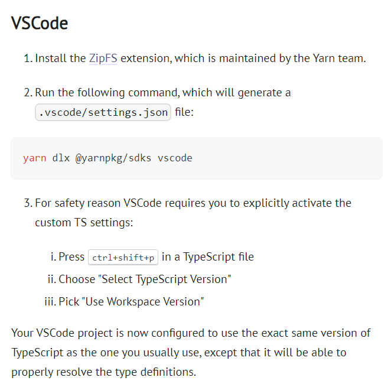
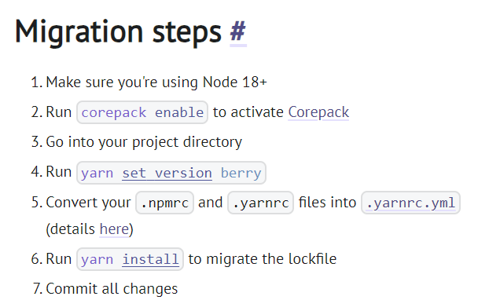
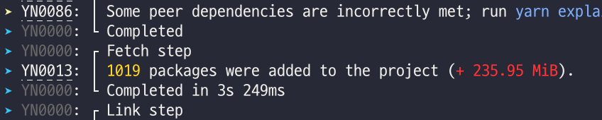

# Yarn Berry Monorepo 구축하기

Yarn Berry(v4)를 이용한 Monorepo 구축하는 과정을 기록했다.

## 1. Monorepo 생성

Monorepo를 생성하는 방법은 다음 같다.

1. 설치

   ```bash
   yarn init -2
   ```

   또는

   ```bash
   yarn set version berry
   yarn init
   ```

2. 버전 확인

   ```bash
   yarn -v
   ```

## 2. Monorepo 설정

### Workspaces 설정

`package.json` 파일에 워크스페이스를 지정한다.

```json
{
  "workspaces": ["packages/*"]
}
```

`packages` 폴더 내에 각 레포지토리가 존재하게 된다.

### 스크립트 설정

루트 디렉터리에서 각 레포지토리의 워크스페이스로 접근할 수 있도록 `package.json` 파일에 스크립트를 설정하자.

```json
{
  "scripts": {
    "A": "yarn workspace A",
    "B": "yarn workspace B",
    "C": "yarn workspace C"
  }
}
```

여기서 `A`, `B`, `C`는 각 레포지토리의 `package.json`에 명시된 `name` 속성 값.

### 공통 패키지 설치

루트 디렉터리에서 공통으로 사용할 패키지들을 설치하자.

ESLint, Prettier, TypeScript 설정은 루트 디렉터리에 설치 및 설정이 이루어진다.

.eslintrc.js, .prettierrc 파일들은 기존 레포지토리에서 사용하던 파일을 그대로 루트 디렉터리에 옮기자.

```json
{
  "devDependencies": {
    "@typescript-eslint/eslint-plugin": "^6.19.1",
    "@typescript-eslint/parser": "^6.19.1",
    "eslint": "^8.56.0",
    "eslint-plugin-prettier": "^5.1.3",
    "eslint-plugin-react": "^7.33.2",
    "eslint-plugin-react-hooks": "^4.6.0",
    "eslint-plugin-react-refresh": "^0.4.5",
    "prettier": "^3.2.4",
    "prettier-plugin-tailwindcss": "^0.5.11",
    "typescript": "^5.3.3"
  }
}
```

### vs code를 위한 추가설정


공식 문서에 따르면 ZipFS와 sdks를 설치해야 한다.

### TypeScript 설정

TypeScript 설정 파일은 공통 설정을 개별 레포지토리에서 extends해 사용한다.

각 레포지토리별 Typescript config 파일은 다음과 같이 사용한다.

```json
// tsconfig.json
{
  "extends": "../../tsconfig.common.json",
  "compilerOptions": {
    "composite": true
  },
  "include": ["src"],
  "references": [
    {
      "path": "./tsconfig.node.json"
    }
  ]
}

// tsconfig.node.json
{
  "extends": "../../tsconfig.node.common.json",
  "include": ["vite.config.ts"]
}
```

## 3. Common 패키지

공통으로 사용될 변수나 함수들을 common 패키지에 모아 관리하자.

### Common 패키지 설정

공통 패키지를 생성하고 `typescript`를 설치한 후, `main`과 `types` 속성을 명시하자.

```json
{
  "main": "index.ts",
  "types": "index.d.ts"
}
```

`index.d.ts` 파일에는 타입을 정의한다.

```typescript
export = TEST;
export as namespace TEST;

declare namespace TEST {
  // 타입 정의...
}
```

`index.ts` 파일에는 실제 함수나 변수를 정의한다.

```typescript
import constants from "./src/constants";
import utils from "./src/utils";

export default { constants, utils };
```

예시로 `utils/index.ts` 파일은 다음과 같다.

```typescript
const fn = () => {
  console.log("fn");
};

export default { fn };
```

다른 패키지에서 이를 사용하려면 다음과 같이 import 해 사용한다.

```typescript
import { utils } from "common";

utils.fn(); // "fn" 출력
```

타입을 사용하려면 다음과 같이 import 해 사용한다.

```typescript
import { Interface } from "common";

const example: Interface = {};
```

## 4. Migration



공식문서의 Migration step을 따라가자.

.npmrc나 .yarnrc 파일이 없었기에 다른 마이그레이션 블로그들을 참고했다.

.yarnrc.yml 에 아래 부분을 추가하자.

`nodeLinker: "node-modules"`

package-lock.json 의 내용을 yarn.lock 으로 옮겨준다고 한다.



.gitignore에 새로운 내용을 추가해 주자.

```
# yarn berry
.yarn/*
!.yarn/cache
!.yarn/patches
!.yarn/plugins
!.yarn/releases
!.yarn/sdks
!.yarn/versions
```

node_modules는 전부 제외하지만 .yarn 을 포함시키는 이유는 zero install 기능을 위함이다.

설치된 패키지들은 Git 저장소에 포함되어 Zero Install 기능을 지원하게 된다.

### Zero Install

기존 패키지를 이식하기 위해 `nodeLinker: "node-modules"`
를 추가해 주었기에 이제 제거해야 한다.

yarn install을 한번 더 실행하자.

이제, `package-lock.json`과 `node_modules`를 삭제해도 된다.

#### 참고한 곳

https://yarnpkg.com/migration/guide

https://velog.io/@sangbooom/%ED%94%84%EB%A1%9C%EC%A0%9D%ED%8A%B8-yarn-berry%EB%A1%9C-%EB%A7%88%EC%9D%B4%EA%B7%B8%EB%A0%88%EC%9D%B4%EC%85%98-%ED%95%98%EA%B8%B0

https://xionwcfm.tistory.com/283
