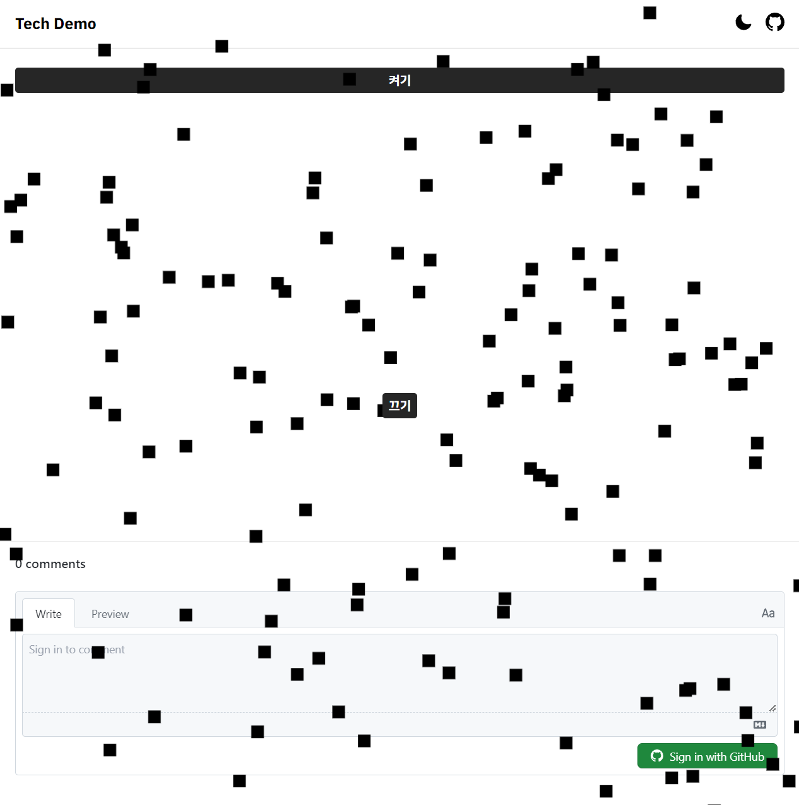
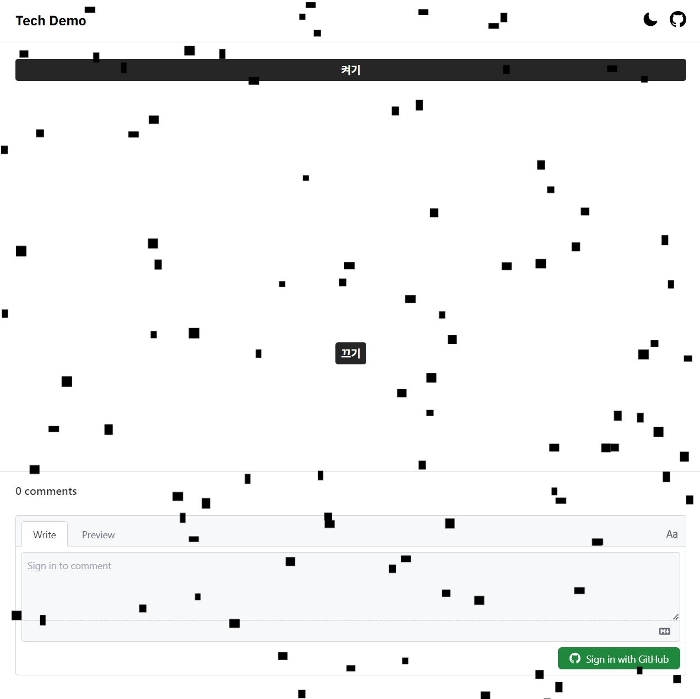
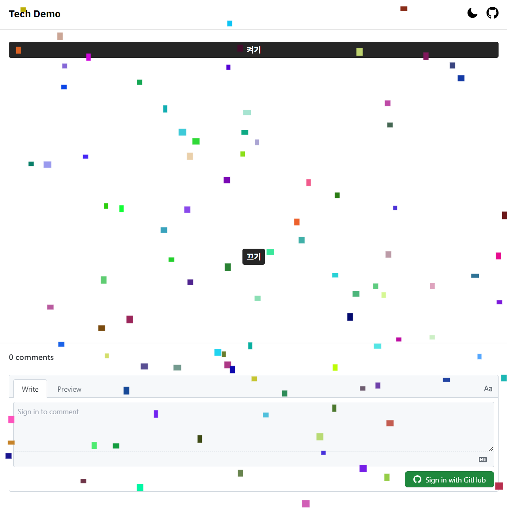
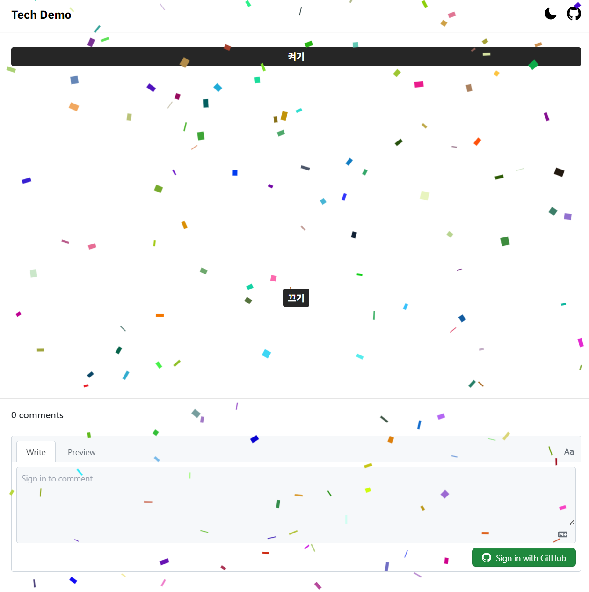

# Confetti Animation

인터넷을 살펴 보니 두가지 방법이 존재하는데, DIV를 통해 하나하나 구현하는것과 Canvas 를 통해 그리는 것이 있었다.

첫번째 방법은 컨텐츠를 가리지 않으면서도 앞쪽에 애니메이션을 줄 수 있어서 좀 더 낫다 싶었으나 DIV를 생성하고, TOP, LEFT를 통해 위치를 바꾸고, ROTATE를 통해 회전하는 등 LayoutShift가 빈번히 일어나 성능상 단점이 존재했다.

그래서 Canvas를 활용해 그려 보자. 모달에는 축하 애니메이션이 포함되지 않도록 구현 해 보자.

## Canvas API

canvas를 초기화 해 주자.

```typescript
// init canvas
useEffect(() => {
  if (canvasRef.current) {
    contextRef.current = canvasRef.current.getContext("2d");

    const dpr = window.devicePixelRatio;

    let vw = Number(canvasRef.current.getBoundingClientRect().width.toFixed(1));
    let vh = Number(
      canvasRef.current.getBoundingClientRect().height.toFixed(1)
    );

    canvasRef.current.width = vw * dpr;
    canvasRef.current.height = vh * dpr;
  }
}, []);
```

## Flow

버튼을 누르면 renderFrame 이 호출되어 렌더링이 시작된다.  
최초에 makeParticle 함수를 통해 Particle을 생성 해 주자.  
renderFrame에서는 Particle 을 단순히 그려주고, 업데이트 해주자.

전체적인 흐름은 다음과 같다.

```typescript
function makeParticles() {}

function renderFrame() {
  if (isShowing.current) requestAnimationFrame(renderFrame);

  const WIDTH = canvasRef.current!.width;
  const HEIGHT = canvasRef.current!.height;

  contextRef.current?.clearRect(0, 0, WIDTH, HEIGHT);

  particles.current.forEach((particle: Particle, index: number) => {
    contextRef.current?.fillRect();
    particles[index].update();
  });
}

function toggle() {
  if (!containerRef.current) return;
  isShowing.current = !containerRef.current.classList.toggle("-z-10");

  if (isShowing.current) {
    makeParticles();
    renderFrame();
  }
}
```

## Particle

Particle Class에 살을 붙여가며 기능을 완성 해 나가자.

```typescript
export class Particle {
  [key: string]: any;

  constructor(width: number, height: number) {
    this.x = Math.random() * width;
    this.y = Math.random() * height;
  }
}
```

canvas 의 width 와 height를 받아 랜덤 위치에 생성된다.



- 크기 랜덤 추가

  ```typescript
  export class Particle {
    [key: string]: any;

    constructor(width: number, height: number) {
      this.x = Math.random() * width;
      this.y = Math.random() * height;
      this.width = Math.floor(Math.random() * 15) + 5;
      this.height = Math.floor(Math.random() * 15) + 5;
    }
  }
  ```

  5 ~ 20의 값을 갖는다.  
   결과를 확인해 보고, 적당한 값을 찾아 넣어주자.

- 중력 추가  
   Update 메소드에서 y위치를 변경 해 주자.  
   Particle마다 속도를 다르게 했다.

  ```typescript
  this.velocity = Math.random() * 2 + 1;

  update() {
    this.y += this.velocity;
  }
  ```

  그리고, 만약 y가 height를 넘어가는 경우 0으로 초기화해 주는 루틴도 추가하자.

  ```typescript
  update(width: number, height: number) {
    this.y += this.velocity;

    if (this.y > height) this.reset();
  }

  reset() {
    this.velocity = Math.random() \* 2 + 1;
    this.y = 0;
  }
  ```

  지금까지의 결과는 다음과 같다.  
  사진으로는 안보이겠지만, 아래로 내려가고 맨 아래에 도달하면 다시 위로 올라간다.



- 색상 추가  
  색상 또한 랜덤으로 설정해 넣어 주자.

  ```typescript
    setColor() {
    this.color = `rgb(${Math.random() * 255},${Math.random() * 255},${
      Math.random() * 255
    })`;
  }

  ```



- x 축 이동 추가  
  x축 이동은 y축처럼 간단하지 않다.  
  y축은 늘 일정하게 증가하면 되나 x축의 경우 좀 다르다.

  왼쪽으로도 이동해야하고 오른쪽으로도 이동해야하고 한쪽으로만 쭉 이동하면 안된다.

  Sin 함수를 사용해 보자.

  ```
    Math.sin((angle * Math.PI) / 180)
  ```

  위 식에 따라 -1~1의 값을 얻을 수 있다.

  ```typescript
  this.angle++;
  this.x += Math.sin((this.angle * Math.PI) / 180);
  ```

  너무 같은 움직임만 반복하니, 진폭과 파장을 조정 해 주자.  
  조정 후의 update 함수는 다음과 같다.

  ```typescript
    update(width: number, height: number) {
    this.y += this.velocity;

    this.angle += this.waveLength;
    this.x += Math.sin((this.angle * Math.PI) / 180) * this.amplitude;

    if (this.angle > 360) this.angle = 0;

    if (this.y > height) this.reset(width, height);
  }
  ```

* 회전 추가

  마지막 관문인 회전만 남았다.  
   회전의 경우 구현하기 까다로운데, 정사영의 개념을 생각 해 보자.  
   그러나 정사영 또한 주기를 갖고 있기에 Thickness만 줄었다 늘렸다 해주면 복잡하게 생각 할 필요 없이 눈속임이 된다.  
   2차원상 회전 + Thickness 조절 로 360도 회전을 구현하자.

  ```typescript
  this.rotation += this.rotationSpeed * this.rotationDirection;

  if (this.isShrinking) {
    this.drawingWidth -= this.d;

    if (this.drawingWidth < this.width / 10) this.isShrinking = false;
  } else {
    this.drawingWidth += this.d;
    if (this.drawingWidth > this.width) this.isShrinking = true;
  }
  ```

  rotation 을 추가하고 width를 조정 해 주자.

  결과가 만족스럽지 않은데, Thickness 조절 시 양 쪽이 줄어들어야 하나 한쪽만 줄어드는 형태이기 때문.  
  중간에서 회전하는 것 처럼 보이도록 fillRect에서 해결하자.

  ```typescript
  contextRef.current?.fillRect(
    -(particle.drawingWidth / 2),
    -(particle.height / 2),
    particle.drawingWidth,
    particle.height
  );
  ```

  이렇게 설정해 중점을 기준으로 회전하는 것 처럼 보이게 하자.

  완성된 Particle 은 다음과 같다.

  ```typescript
  export class Particle {
    [key: string]: any;

    constructor(width: number, height: number) {
      this.x = Math.random() * width;
      this.y = Math.random() * height;
      this.width = Math.floor(Math.random() * 10) + 10;
      this.height = Math.floor(Math.random() * 10) + 10;
      this.drawingWidth = Math.random() * this.width;

      this.velocity = Math.random() * 2 + 1;
      this.angle = Math.floor(Math.random() * 360);
      this.amplitude = Math.random() * 3;
      this.waveLength = Math.random() / 2;

      this.rotationSpeed = Math.random() * 2 + 2;
      this.rotationDirection = Math.random() > 0.5 ? 1 : -1;
      this.rotation = Math.random() * 360;

      this.isShrinking = true;
      this.d = this.width / 20;

      this.setColor();
    }

    update(width: number, height: number) {
      this.y += this.velocity;

      this.angle += this.waveLength;
      this.x += Math.sin((this.angle * Math.PI) / 180) * this.amplitude;

      this.rotation += this.rotationSpeed * this.rotationDirection;

      if (this.isShrinking) {
        this.drawingWidth -= this.d;

        if (this.drawingWidth < this.width / 10) this.isShrinking = false;
      } else {
        this.drawingWidth += this.d;
        if (this.drawingWidth > this.width) this.isShrinking = true;
      }

      if (this.angle > 360) this.angle = 0;
      if (this.rotation > 360) this.rotation = 0;
      if (this.y > height) this.reset(width, height);
    }

    reset(width: number, height: number) {
      this.x = Math.random() * width;
      this.y = 0;
      this.width = Math.floor(Math.random() * 10) + 10;
      this.height = Math.floor(Math.random() * 10) + 10;
      this.drawingWidth = Math.random() * this.width;

      this.velocity = Math.random() * 2 + 1;
      this.angle = Math.floor(Math.random() * 360);
      this.amplitude = Math.random() * 3;
      this.waveLength = Math.random() / 2;

      this.rotationSpeed = Math.random() * 2 + 2;
      this.rotationDirection = Math.random() > 0.5 ? 1 : -1;
      this.rotation = Math.random() * 360;

      this.isShrinking = true;
      this.d = this.width / 20;

      this.setColor();
    }

    setColor() {
      this.color = `rgb(${Math.random() * 255},${Math.random() * 255},${
        Math.random() * 255
      })`;
    }
  }
  ```

완성된 모습은 다음과 같다.


