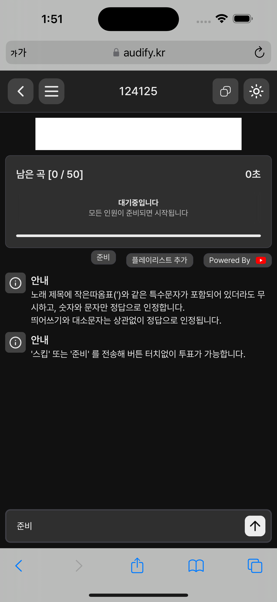
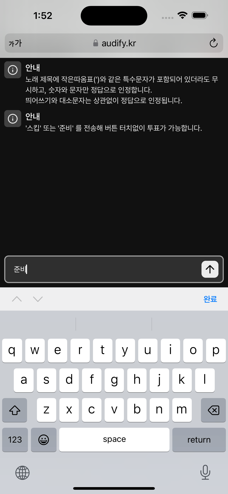
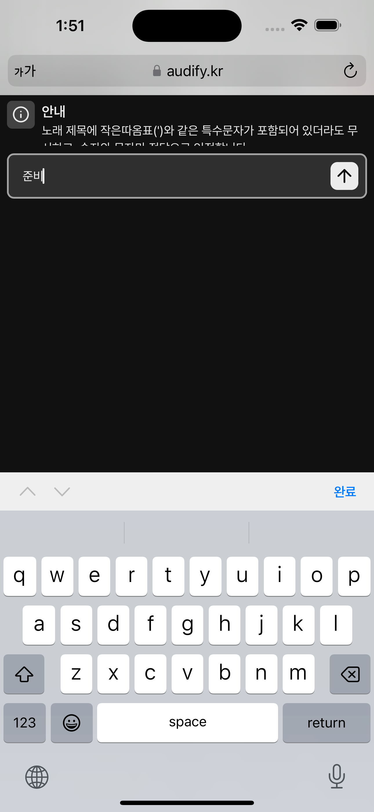
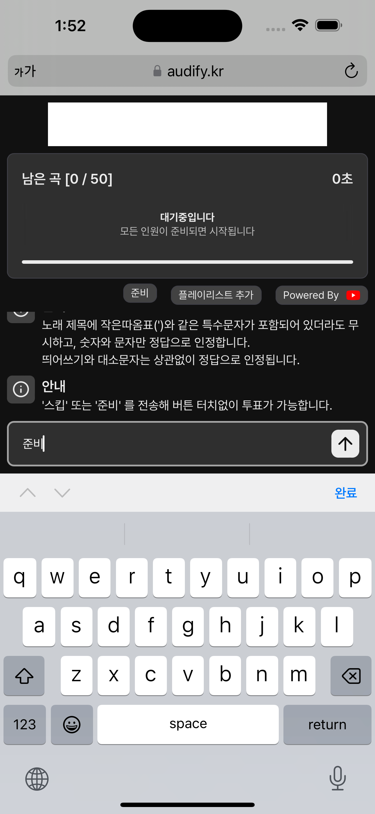
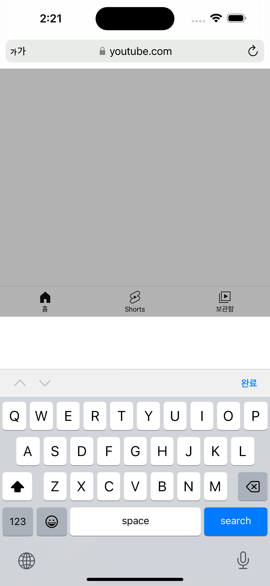
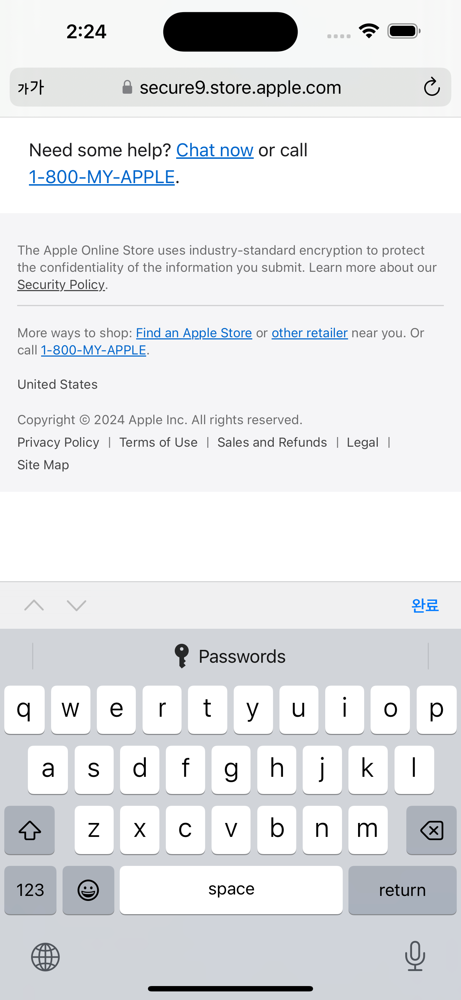
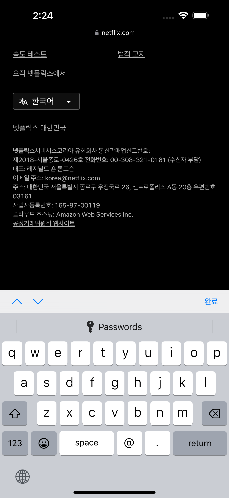
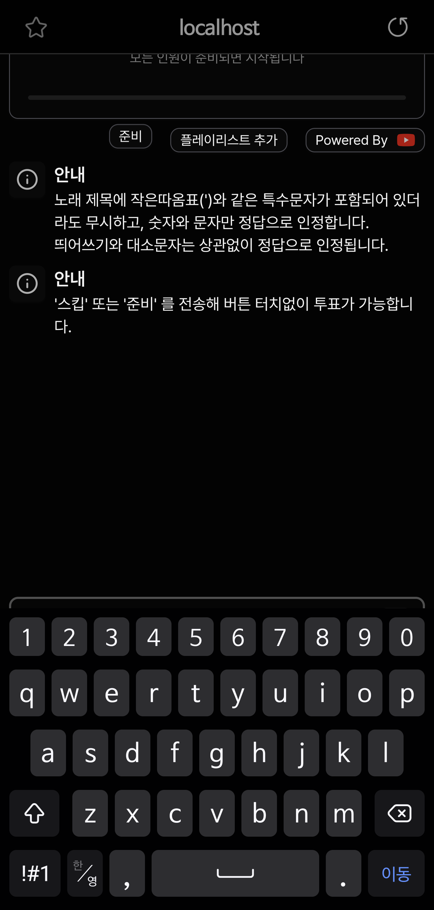
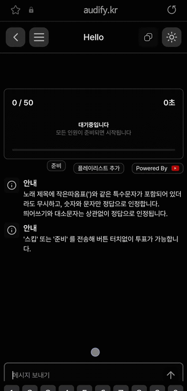

# Cross Browsing 호환성 개선하기 2

## 레이아웃 문제



이 상황에서 키보드에 포커스가 주어지면 다음과 같이 설정되게 하고 싶다.

1. 채팅창을 제외한 구성요소는 그 위치에 그대로 존재.
2. 입력창은 키보드 위에 위치.

지금 입력창에 포커스가 주어진다면 다음과 같이 보이게 된다.



dynamic viewport로 높이가 설정되어 있는데, 키보드의 높이만큼 위쪽이 보이지 않게 된다.

그러면, dynamic viewport 에서 키보드 높이를 제외하면 어떨까?

될 때도 있고, 안될때도 있다.



높이를 줄였어도 하단에 빈 공간이 생기는 경우가 존재했다.

html 높이는 분명 키보드를 제외한 높이인데, 아래쪽에 html외부의 가상 공간이 생기는 경우가 가끔 생겼다.

높이를 건들진 말고, 고정 원하는 구성요소들을 스크롤이 내려가도 화면에 고정시키자.



원하는 대로 됐다.

근데, 문제가 있었다.

## 모바일 IOS

인풋창에서 스크롤을 내리면, 가상 공간이 또 생기는 문제가 존재했다.

다른 사이트들은 어떻게 해결했나 싶어 찾아봤는데, 해결한 곳이 없었다.


  


차례로 유튜브, 애플, 넷플릭스.

공간을 없애는게 아니라, 포커스 내부에서 터치를 통해 스크롤을 하지 못하게 막아 해결했다.

```ts
const handleTouchOutside = (event: TouchEvent) => {
  if (
    wrapperRef.current &&
    inputRef.current &&
    !wrapperRef.current.contains(event.target as Node)
  ) {
    inputRef.current.blur();
  }
};
```

### 자동재생 문제

IOS에서는 자동재생 제약이 많다.

무조건 음소거 상태여야 자동 재생이 가능하고, 저전력 모드에서는 자동 재생이 불가능하다.

user event로 인한 재생은 가능한데, 준비 투표를 하는 경우 재생시키도록 설정해 재생이 되도록 설정했다.

### 입력 버퍼 문제

해결 중..

## 삼성 브라우저



삼성 브라우저에서도 가끔씩 문제가 발생했다.

포커스시에 키보드 위에 입력창이 존재해야 하는데, 키보드 밑 위치에 존재하는 문제였다.

사이즈를 보아하니 하단 작업표시줄 높이만큼 아래로 위치하므로, 키보드 높이와 작업표시줄 높이 계산 과정에서 오류가 발생하는 것 같다.

삼성브라우저에서만 작동하는 로직을 추가했다.

```ts
useEffect(() => {
  if (/SamsungBrowser/i.test(navigator.userAgent)) {
    if (!isKeyboardActive) {
      setKeyboardPadding(0);
    } else {
      setTimeout(() => {
        requestAnimationFrame(() => {
          if (!visualViewport || visualViewport.offsetTop === 0) return;

          const padding =
            keyboardHeight - (window.visualViewport?.offsetTop ?? 0);

          if (Math.round(padding) > 0) {
            setKeyboardPadding(padding);
          }
        });
      }, 300);
    }
  }
}, [isKeyboardActive, keyboardHeight]);
```

visualViewport를 바로 계산하면, 키보드는 올라오는 중이므로 계산이 되지 않는다.

키보드 올라오는 속도를 너그럽게 계산해 300ms로 잡고, 어긋나는 높이를 계산했다.

padding 만큼 입력창을 올려 주었다.

밑에 공간이 생기지만, 똑같이 입력창을 통한 스크롤을 불가능하게 만들어 해결했다.



정상 동작하는 경우

  
하단 작업표시줄 만큼 덜 올라온 경우.  
키보드가 다 올라오고 난 후 한번 더 올라와 높이를 맞춘다.
