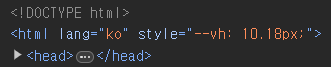
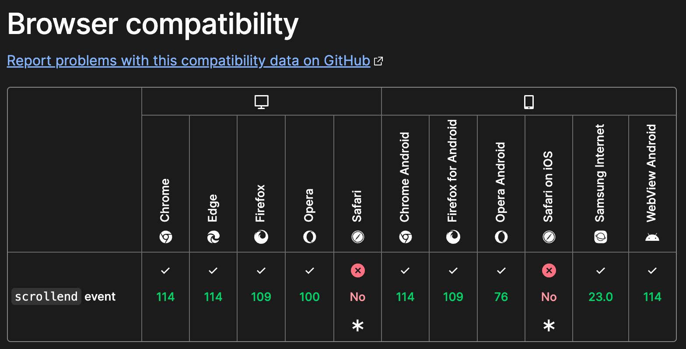
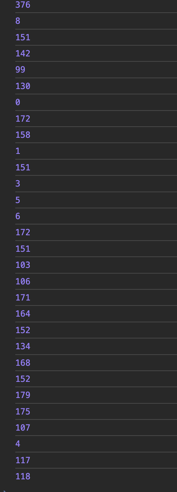

# Cross Browsing 호환성 개선하기

## 1. 100vh에서 발생한 문제

높이를 100vh로 설정하는 경우 모바일 환경에서 주소창이나 UI에 의해 가려지게 되는데, 꽤나 골치아프다.

다행히도 새로운 단위를 지원하는데, dvh, lvh, svh는 각각 dynamic viewport height, large viewport height, small viewport height를 의미한다.

svh는 UI가 최대로 확장된 경우의 viewport height를 의미하고, lvh는 UI가 최소화된 경우의 viewport height를 의미한다.

dvh는 현재 UI 상태에 맞춰 표시되는 동적인 viewport height를 의미한다.

### 해결 1. dvh 사용하기

```css
.element {
  @supports (height: 100dvh) and (width: 100dvw) {
    height: calc(100dvh - 128px);
    width: 100dvw;
  }
}
```

dvh 를 지원하면 사용하게 했다.

만약 dvh를 지원하지 않는다면?

### 해결 2.window.innerHeight

dvh를 지원하지 않는다면, 최초 접속시 동적으로 계산해야 한다.

다행히도, window.innerHeight를 통해 구할 수 있다.

```ts
const getScreenHeight() {
  return window.innerHeight * 0.01;
}
```

이걸 css에서 접근해 사용해야 하는데, 사용자 정의 속성을 사용해 보자.

```ts
const setScreenHeight = () => {
  const vh = window.innerHeight * 0.01;
  document.documentElement.style.setProperty("--vh", `${vh}px`);
};
```

setScreenHeight 를 root에서 최초 한번 실행해 주자.

실행해 주면 다음과 같이 사용자 정의 속성이 설정된다.



그러면, css파일은 다음과 같이 설정할 수 있다.

```css
.element {
  height: calc(var(--vh, 1vh) * 100 - 128px);

  @supports (height: 100dvh) and (width: 100dvw) {
    height: calc(100dvh - 128px);
    width: 100dvw;
  }
}
```

## 2. indexedDB가 초기화되는 문제점

iframe의 indexedDB로 접근하고 있는데, 페이지 이동시 데이터가 초기화된다는 문제점이 발생했다.

특히, Safari에서만 해당 문제점을 재현할 수 있었는데, 문제점 파악에 꽤 시간이 들었다.

결론부터 말하자면, 동일한 주소의 iframe으로 접근하고 있더라도 서브도메인이 다르면 새로운 indexedDB가 생성될 수 있다는 것이었다.

관련 내용을 더 찾아보면 아래와 같은 내용을 찾을 수 있었다.

### Origin 정책

Chrome에서는 서브 도메인 간에 동일한 origin 정책을 따르므로, 다른 서브 도메인에서 동일한 주소의 iframe을 통해 접근하더라도 동일한 IndexedDB에 접근할 수 있다.

이는 Chrome이 동일한 최상위 도메인(TLD)과 프로토콜을 동일한 origin으로 간주하기 때문이라고 한다.

Safari에서는 각 서브 도메인을 별개의 origin으로 취급한다. 따라서, 다른 서브 도메인에서 동일한 주소의 iframe을 통해 IndexedDB에 접근하려고 하면, Safari는 이를 새로운 IndexedDB로 인식한다.

이는 Safari가 보안 측면에서 origin의 정의를 더 엄격하게 적용하기 때문이라고 한다.

참고로, IndexedDB 뿐만 아니라 localStorage, SessionStorage등 모두 해당한다.

### 해결하기

Same-Site간 자원 공유는 현재 쿠키만 허용하고 있다.  
그래서, IndexedDB에 저장하는 데이터를 쿠키에 저장해야 한다.

그러나 쿠키는 한개당 데이터가 4KB로, 굉장히 작다.

IndexedDB에는 객체 형태로 저장하는데, key값만큼 공간을 절약하기 위해 배열 형태로 바꾸었다. (순서만 알면 되므로)

사용하지 않는 정보들을 제거하니 어느정도 데이터를 압축시킬 수 있었어서 쿠키에 충분히 담을 수 있었다.

## 3. onscrollend가 동작하지 않는 문제점(Safari)

스크롤 위치를 기억하는 기능을 추가하는 과정에서 벌어진 상황이었다.

onscrollend시 해당 scroll height를 기억하는 간단한 로직이었는데, IOS에서 동작하지 않았다.

설마하고 살펴보니...



미리 살펴봤어야 했는데, 실수했다.

그리고, 다른 브라우저들의 지원 버전도 넉넉하지가 않다.

크롬 114 버전이면 고작 몇개월 전이기 때문.

onscroll을 통해 직접 구현해 보자.

### debounce와 throttle

Debounce는 연속적인 이벤트 발생 시 일정 시간 동안 마지막 이벤트만 처리하여 성능을 최적화하는 기술이다.  
처리중인 이벤트가 있다면 초기화하고 다시 설정하는 방식으로 구현이 가능하다.

Throttle은 연속적인 이벤트 발생 시 일정 시간 간격으로 이벤트를 처리하여 과도한 이벤트 핸들링으로 인한 성능 저하를 방지하는 기술이다.  
처리중인 이벤트가 있다면 무시하는 방식으로 구현이 가능하다.

debounce 방식을 선택하자.

마지막 onscroll이벤트 이후 언제 onscrollend 이벤트가 호출되는지 측정해 봤다.



바로 호출될 때도 있지만, 일반적으로 150ms 정도 소요된다.

```ts
clearTimeout(timerRef.current);
timerRef.current = setTimeout(() => {
  setScrollHeight(elementRef.current?.scrollTop ?? 0);
}, 150);
```

위처럼 간단하게 구현할 수 있었다.

교훈 : 호환성을 잘 확인하자.
