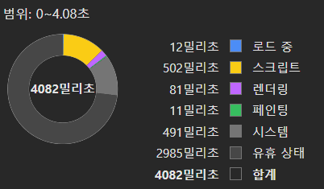

# 성능 최적화

테이블에서 업비트와 바이낸스의 Socket을 사용해 데이터를 State에 저장해 사용하고 있다.

데이터는 매우 빠르게 받아오는데, 초당 몇십개의 데이터가 받아와 저장된다.

성능을 한번 개선시켜 보자.

## Throttle

- Throttle  
  Throttle은 특정 시간 간격 동안 하나의 이벤트만 처리하도록 하는 기법이다.  
  Debounce와 비슷하게 자주 발생하는 이벤트를 제한하는데, Throttle은 일정 시간 동안 발생한 이벤트 중 첫 번째 또는 마지막 이벤트를 처리하고, 그 시간 동안 다른 이벤트는 무시한다.

그러면, 배열을 하나 사용해서 Throttle 기법을 적용시켜 볼 수 있다.

```ts
ws.onmessage = (data) => {
  tempArray.push(data);

  if (!timer) {
    timer = setTimeout(() => {
      tempArray.forEach((data) => {
        setCoinMap((prevMap) => {
          const newMap = new Map(prevMap);

          const prevData = prevMap.get(data.symbol);
          newMap.set(data.symbol, { ...prevData, ...data });

          return newMap;
        });
      });
      tempArray = [];
      timer = null;
    }, THROTTLE_DELAY);
  }
};
```

timer가 동작중이라면, tempArray에 push 후 아무런 로직이 실행되지 않는다.

timer가 동작을 종료하고 초기화했다면, 새로운 timer를 동작시킨다.

tempArray의 내용을 Coin Map에 적용시키게 된다.

여기서 한번 더 개선시킬 수 있다.

THROTTLE_DELAY동안 같은 데이터가 한번 이상 전송되었다고 생각 해 보자.

그러면, 이전 데이터는 무시해도 된다.

즉, 배열을 사용할 필요가 없다.

Map을 사용하자.

참고로 Map 또한 이터러블하다.

```ts
ws.onmessage = (data) => {
  tempMap.set(data.symbol, data);

  if (!timer) {
    timer = setTimeout(() => {
      tempMap.forEach((data) => {
        setCoinMap((prevMap) => {
          const newMap = new Map(prevMap);

          const prevData = prevMap.get(data.symbol);
          newMap.set(data.symbol, { ...prevData, ...data });

          return newMap;
        });
      });
      tempMap.clear();
      timer = null;
    }, THROTTLE_DELAY);
  }
};
```

실제 코드에서는 추가적인 로직이 더 존재하지만 하지만 메인 흐름은 동일하다.


테이블에 출력 해 보면, 모든 테이블이 매번 렌더링되고 있다.

당연히 Table의 디펜던시로 CoinMap을 받고 있기 때문이다.

메모이제이션을 활용해 Row별 메모이제이션을 해 보자.

```tsx
const table = useMemo(
  () => (
    <Table className="bg-popover rounded-lg border-none shadow-sm">
      // 테이블...
    </Table>
  ),
  [coinMap]
);
```

coinMap이 갱신될 때 마다, 매번 table이 새로 만들어진다.

useRef를 사용하면 컴포넌트가 리렌더링되더라도 ref 객체의 .current 속성은 변경되지 않으므로 메모이제이션 효과를 누릴 수 있다.

ref의 참조는 그대로 유지되어 GC가 이루어 지지 않는다.

그래서, 메모이제이션된 Row Component를 Ref에 저장하고, 조건에 따라 불러오자.

```ts
{
  table.getTopRows().map((row) => {
    const memoizedRow = memoizedRowMap.current.get(row.original.market);

    if (
      memoizedRow &&
      memoizedRow.trade_price === row.original.trade_price &&
      memoizedRow.binance_price === row.original.binance_price &&
      memoizedRow.isPinned === row.getIsPinned()
    ) {
      return memoizedRow.element;
    } else {
      return createRowElement(row);
    }
  });
}
```

메모이제이션된 element가 존재하고, 조건을 만족하면 이전 element를 그대로 사용한다.  
그렇지 않다면 새로운 element를 생성해 메모이제이션해 다음에 사용할 수 있도록 한다.

row또한 Map으로 이루어져 새로운 row 생성시


이제, 변경되는 Row만 렌더링이 새로 이루어지고 있다.

테이블은 이정도만 해도 충분할 것 같다.

이제, 현재가를 한번 보자.


현재가가 증가하거나 감소하면 테두리의 border를 통해 업데이트됨을 알려주고 있다.

이는 class를 추가하고 제거하는 형태로 이루어지고 있는데, 변경된 Row 하나마다 timeout이 하나 들어가므로 매우 비효율적이다.

```ts
useEffect(() => {
  if (!priceContainer.current) return;

  priceContainer.current.classList.remove("RISE");
  priceContainer.current.classList.remove("FALL");

  if (change) priceContainer.current.classList.add(change);
  const timeout = setTimeout(() => {
    if (priceContainer.current) {
      priceContainer.current.classList.remove("RISE");
      priceContainer.current.classList.remove("FALL");
    }
  }, ANIMATION_DELAY_MS);
  return () => {
    clearTimeout(timeout);
  };
}, [priceContainer, change, mainPrice]);
```

RISE 와 FALL 클래스를 통해 해당 border를 적용시키고 있다.

그러나, 개별 Cell 하나마다 Timeout을 생성하므로 성능이 좋지 않다.

```tsx
return (
  <div
    className={`box-border flex h-10 flex-col content-center justify-center border border-[transparent] text-right font-medium text-[hsl(var(--foreground))] ${change}] transition-border`}
    ontransitionend={cleanup}
  >
    // ...
  </div>
);
```

border에 transition을 주고, transition이 끝나면 자동으로 제거되도록 수정했다.

- 수정 전  
  

- 수정 후  
  

스크립트 부분이 많이 감소해, 실제로 성능이 개선되었다.

그러나 치명적인 문제점이 있었는데, border 표기중 검색이나 정렬을 하는 경우에 문제가 발생했다.  
정렬이나 검색시 순서가 변하면서 렌더링이 다시 이루어지게 되는데, 이때 클래스가 남아있는 상태에서 다시 이루어져 transitionEnd 가 발동되지 않아 가격이 업데이트 될 때 까지 그대로 남는다.

대안을 찾아 보자.

1. 페이지네이션
2. Delay 조정

페이지네이션으로 재 렌더링되는 컴포넌트를 줄여 성능을 향상시키자.

Delay도 조정하자.

Throttle 딜레이는 250에서 375로 높였다.  
Timer 딜레이는 375에서 250으로 낮췄다.

페이지네이션과 딜레이를 줄임으로 실행중인 타이머 개수를 줄였다.



성능이 많이 개선되었다.
