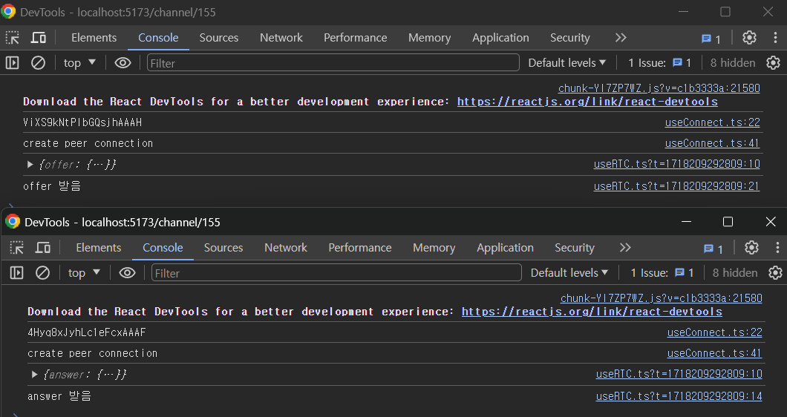
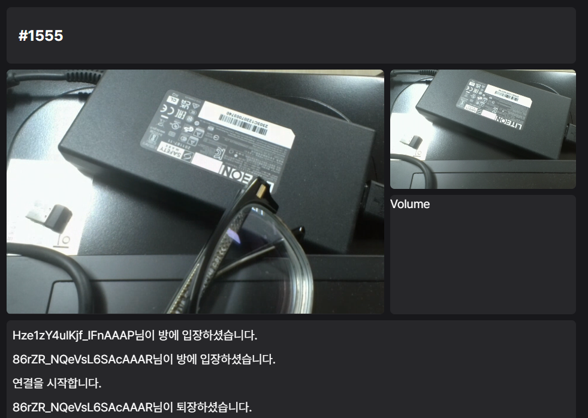
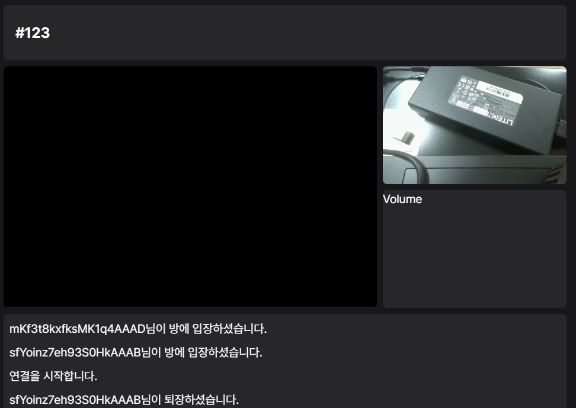

## webRTC

WebRTC (Web Real-Time Communication)은 브라우저에서 P2P(Peer-to-Peer) 통신을 통해 실시간 데이터(음성, 영상 등)을 가능하게 해 주는 기술이다.

주요 구성 요소에 대해 간단하게 알고 넘어가자.

다른 블로그나 문서에 자세히 나와있으니, 필요하면 해당 사이트를 참고하자.

### WebRTC의 주요 구성 요소

1. **MediaStream**: 사용자의 미디어 장치를 연결
2. **RTCPeerConnection**: P2P 연결을 담당
3. **RTCDataChannel**: 실제 데이터 전송이 이루어지는 채널

### WebRTC에서 자주 사용되는 용어

1. **STUN Server, TURN Server**

   - STUN서버는 클라이언트가 자신의 Public IP 주소를 확인해, P2P 연결을 설정하는 데 필요한 정보를 획득하기 위한 서버.
   - TURN서버는 클라이언트 간의 직접 통신이 불가능한 경우, TURN 서버는 데이터 패킷을 중계하여 통신이 원활하게 이루어지도록 한다.

2. **Signaling Server**:
   - WebRTC에서 P2P 연결을 설정하기 위한 초기 통신 과정에 사용된다.
   - SDP, ICE Candidate 등을 교환한다.

### WebRTC 통신 과정

1. **Signaling 단계**:

   - 클라이언트 A와 B가 Signaling 서버를 통해 초기 연결 정보를 교환한다.
   - 이 단계에서 ICE Candidate, SDP 정보 등이 교환된다.

2. **ICE 단계**:

   - 클라이언트 A와 B는 STUN(TURN) 서버를 통해 자신의 공용 IP와 포트를 알아낸다.

3. **P2P 연결 설정**:

   - RTCPeerConnection을 사용하여 P2P 연결이 설정된다.
   - 연결이 성공하면, 오디오, 비디오, 데이터 스트림이 전송된다.

4. **데이터 전송**:
   - MediaStream API와 RTCDataChannel API를 통해 실제 데이터가 전송된다.

Node.js를 사용하여 채널에 참가하고 퇴장하는 간단한 서버를 만들어 봤다.

이 서버는 클라이언트가 채널에 참가하고 퇴장하는 것을 처리해 준다.

이 서버에 내용을 추가해가며 완성 해 나가자.

```js
const express = require("express");
const app = express();
const httpServer = require("http").createServer(app);
const io = require("socket.io")(httpServer, {
  cors: {
    origin: "*",
    methods: ["GET", "POST"],
  },
});

const PORT = 6125;

const channelList = new Map();

io.on("connection", (socket) => {
  console.log("New client connected:", socket.id);

  // 채널
  socket.on("create or join", (channel) => {
    let attendants = channelList.get(channel);

    if (!attendants) {
      channelList.set(channel, new Set());
      attendants = channelList.get(channel);
    }
    attendants.add(socket.id);

    const numClients = Array.from(attendants).length;

    if (numClients === 1) {
      socket.join(channel);
      socket.emit("message", `${socket.id}님이 방에 입장하셨습니다.`);
    } else if (numClients === 2) {
      socket.join(channel);
      io.sockets.in(channel).emit("ready", channel);

      io.sockets
        .in(channel)
        .emit("message", `${socket.id}님이 방에 입장하셨습니다.`);
      io.sockets.in(channel).emit("message", `연결을 시작합니다.`);
    } else {
      socket.emit("channel join failed", `${channel} is full`);
    }
  });

  socket.on("leave", (channel) => {
    socket.leave(channel);
    let attendants = channelList.get(channel);
    if (attendants && attendants.has(socket.id)) {
      attendants.delete(socket.id);
      io.sockets
        .in(channel)
        .emit("message", `${socket.id}님이 퇴장하셨습니다.`);

      io.sockets.to(channel).emit("wait", channel);
    }
  });

  // 클라이언트
  socket.on("disconnect", () => {
    console.log("Client disconnected:", socket.id);
  });

  socket.emit("connect success", socket.id);
});

app.use((req, res, next) => {
  res.header("Access-Control-Allow-Origin", "*");
  res.header(
    "Access-Control-Allow-Headers",
    "Origin, X-Requested-With, Content-Type, Accept"
  );
  next();
});

httpServer.listen(PORT, () => {
  console.log(`Server listening on Port`, PORT);
});
```

연결을 위해서는 클라이언트끼리 ICE 후보와 SDP 를 교환해야 한다.

교환하는 과정을 구현해 보자.

https://webrtc.org/getting-started/peer-connections?hl=ko

위 예제를 따라가며 구현하였다.

```ts
// 호출 측에서 수행해야 하는 코드
async function makeCall() {
  const configuration = {
    iceServers: [{ urls: "stun:stun.l.google.com:19302" }],
  };
  const peerConnection = new RTCPeerConnection(configuration);
  signalingChannel.addEventListener("message", async (message) => {
    if (message.answer) {
      const remoteDesc = new RTCSessionDescription(message.answer);
      await peerConnection.setRemoteDescription(remoteDesc);
    }
  });
  const offer = await peerConnection.createOffer();
  await peerConnection.setLocalDescription(offer);
  signalingChannel.send({ offer: offer });
}

// 수신 측에서 수행해야 하는 코드
const peerConnection = new RTCPeerConnection(configuration);
signalingChannel.addEventListener("message", async (message) => {
  if (message.offer) {
    peerConnection.setRemoteDescription(
      new RTCSessionDescription(message.offer)
    );
    const answer = await peerConnection.createAnswer();
    await peerConnection.setLocalDescription(answer);
    signalingChannel.send({ answer: answer });
  }
});
```

먼저 SDP Offer를 생성하고, 이를 시그널링 서버를 통해 상대방에게 전달한다.

상대방은 이 Offer를 받아 SDP Answer를 생성하고 다시 시그널링 서버를 통해 호출 측에 전달한다.

위 예제 코드를 바탕으로 함수를 만들었다.

socket에서는 handshake라는 이름으로 offer와 answer를 주고받도록 했다.

`client`

```ts
const createPeerConnection = (socket: Socket, channel: string) => {
  const pc = new RTCPeerConnection(configuration);

  socket.on("handshake", async (message) => {
    console.log(message);
    if (message.answer) {
      const remoteDesc = new RTCSessionDescription(message.answer);
      await pc.setRemoteDescription(remoteDesc);
      console.log("answer 받음");
    }
    if (message.offer) {
      pc.setRemoteDescription(new RTCSessionDescription(message.offer));
      const answer = await pc.createAnswer();
      await pc.setLocalDescription(answer);
      socket.emit("handshake", { channel, answer });
      console.log("offer 받음");
    }
  });

  pc.onicecandidate = (event) => {
    if (event.candidate) {
      socket.emit("icecandidate", channel, event.candidate);
    }
  };

  socket.on("icecandidate", async (message) => {
    if (message.iceCandidate) {
      try {
        await pc.addIceCandidate(message.iceCandidate);
      } catch (e) {
        console.error("Error adding received ice candidate", e);
      }
    }
  });

  peerConnection.current = pc;
};

// 연결 시작
const makeCall = async (socket: Socket, channel: string) => {
  if (!peerConnection.current) return;

  const offer = await peerConnection.current.createOffer();
  await peerConnection.current.setLocalDescription(offer);
  socket.emit("handshake", { channel, offer });
};
```

makeCall 호출하면 offer를 보내 연결을 시작한다.

`server`

```ts
socket.on("handshake", (data) => {
  const { channel, offer, answer } = data;
  // 채널에 있는 상대 중 자신을 제외하고 offer 또는 answer 전달
  io.sockets.to(channel).except(socket.id).emit("handshake", { offer, answer });
});
```

채널에 2명이 접속하면 ready를 보내 클라이언트 측에서 createPeerConnection 함수가 실행되고, peerConnection이 송신측과 수신측 둘 다 준비됐다면 둘 중 한쪽에서 makeCall을 호출해 연결이 시작된다.

여기까지 구현했으면 다음과 같은 결과를 볼 수 있다.



offer와 answer 객체를 보면 sdp 정보가 들어있다.

이제, ICE 후보를 교환해야 한다.

`onicecandidate` 리스너가 호출되어야 하는데, 호출되지 않는 문제가 발생했다.

https://stackoverflow.com/questions/38036552/rtcpeerconnection-onicecandidate-not-fire
를 보니, addStream을 먼저 호출해 stream 연결해야 ICE후보가 생성되는 구조인 듯 하다.

https://developer.mozilla.org/en-US/docs/Web/API/RTCPeerConnection/addStream 를 보면, addStream은 더이상 사용되지 않는다.  
addTrack 을 사용하자.

```ts
// 자신의 stream을 peerConnection에 등록해 주자.
stream.getTracks().forEach((track) => {
  pc.addTrack(track, stream);
});
```

이제, `onicecandidate` 리스너가 호출된다.

```ts
socket.on("icecandidate", (data) => {
  const { channel, candidate } = data;
  // 채널에 있는 상대 중 자신을 제외하고 icecandidate 전달
  io.sockets.to(channel).except(socket.id).emit("icecandidate", { candidate });
});
```

서버에 해당 코드를 추가해주었다.

교환한 ICE 후보를 통해 상대방의 stream에 접근이 가능해진다.

video tag에 등록하자.

```ts
pc.ontrack = async (event) => {
  const video = document.querySelector("#video");

  if (video) {
    const [remoteStream] = event.streams;
    (video as HTMLVideoElement).srcObject = remoteStream;
  }
};
```

ontrack 리스너를 설정해 주면 ICE 후보가 교환되고 `pc.ontrack`리스너가 실행된다.

그러면, 상대방의 오디오와 비디오가 연결된다.



연결을 끊은 이후 안경을 치웠다.

disconnect 시 아무런 처리를 안해주다 보니, 마지막 스냅샷이 그대로 남아있다.

disconnect 를 별도로 만들어 처리해 주자.

```ts
socket.on("closeConnection", () => {
  if (stream) stream.getTracks().forEach((track) => track.stop());
  pc.close();
});
```

퇴장 메시지 보낼때 closeConnection도 같이 보내주었다.

RTCPeerConnection 를 종료해 모든 미디어 스트림을 정지시킬 수 있다.



이제, 연결이 끊어지면 video 태그와 stream 객체의 연결이 종료된다.

남아있는 Challenge

1. Channel Leave 시 처리  
    unmount시 emit('leave', '채널명')을 호출해 채널에서 나가는 것을 알리고 있다.  
    unmount 전에 disconnect 되는 경우 (브라우저 종료 등)에는 어떻게 처리해야 할까?  
   socketId를 통해 속한 채널을 하나하나 찾아 leave 처리를 해주어야 할까?  
   socketId별 참여중인 채널을 관리하면 어떨까?

2. 다대다 연결  
    1:1 연결만 처리했다.  
   여러명 연결도 처리해 보자.
