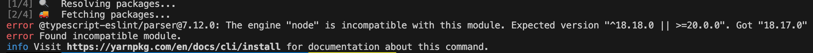
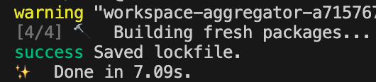
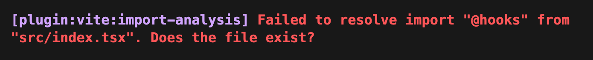
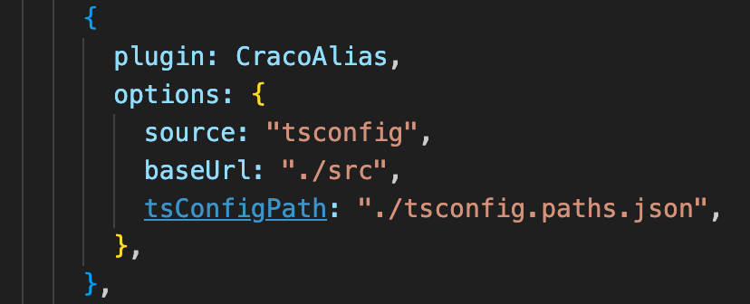
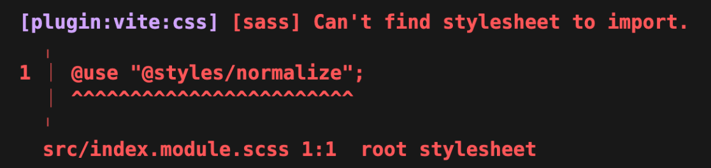
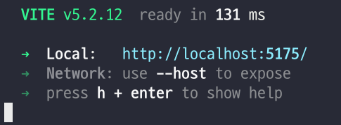
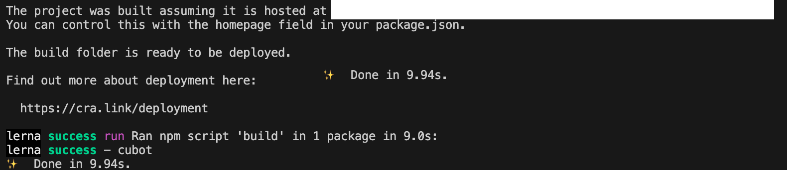

# Webpack -> Vite Migration

## 1. 설치하기

기존 프로젝트에 Vite와 @vitejs/plugin-react를 설치해 주는 것과, 새로운 Vite 프로젝트를 생성해 src를 옮기는 방법 두 가지가 존재한다.

새로운 Vite 프로젝트를 생성하는 방법은 깨끗한 환경에서 시작할 수 있어 불필요한 파일이나 설정이 남지 않을 것 같아 선택하게 되었다.

프로젝트 규모와 복잡도에 따라 적합한 방법을 선택하자.

## 2. 설정하기

tsconfig, eslint, prettier등을 포함한 기본적인 설정 파일들을 옮겨줘야 한다.

webpack 기반의 craco를 사용하고 있었기에, craco.config.js를 vite.config.ts에 옮겨 주었다.

이 과정에서 craco 설정을 Vite 설정으로 변환하는 작업이 필요하다.

package.json을 옮기는 과정에서 설치한 Vite의 버전에 맞게 React 버전도 변경해 주었는데, package-lock (혹은 yarn.lock)이 존재한다면 삭제 후 재설치 해 주자.



노드 버전이 호환되지 않는다는 오류가 떴는데, nvm을 사용 중이었기에 쉽게 해결할 수 있었다.



설치가 성공적으로 완료되었으니 다음 단계로 넘어가자.

## 3. 진입점 수정

CRA를 통해 생성되었기 때문에 Vite와의 index.html 위치와 진입점이 다르다.

Vite는 src/main.tsx, CRA는 src/index.tsx이므로 Vite에 맞게 수정을 해 주자.

index.html 내부 script 태그의 src를 기존의 src/index.tsx로 변경해 주었다.

```html
<!doctype html>
<html lang="en">
  <head>
    <meta charset="UTF-8" />
    <link rel="icon" type="image/svg+xml" href="/vite.svg" />
    <meta name="viewport" content="width=device-width, initial-scale=1.0" />
    <title>Vite + React + TS</title>
  </head>
  <body>
    <div id="root"></div>
    <!-- script 태그의 src를 기존의 src/index.tsx로 변경하자 -->
    <script type="module" src="/src/main.tsx"></script>
  </body>
</html>
```

이제, dev 명령어를 실행해 보자.

## 4. 오류 해결하기



@로 시작하는 경로를 인식하지 못한다.

이는 craco가 webpack 기반이고, 경로 설정은 craco alias를 통해 tsconfig.path에 설정해준 경로들을 적용시키는데, webpack 을 버렸으니 당연히 제대로 동작할 리 없었을 것이다.

craco config을 vite config으로 옮기는 과정에서 깜빡했다.



경로 설정은 craco config에서 cracoAlias라는 플러그인을 통해 이루어지는데, 이 부분이 Vite에서 동작하도록 해 주어야 한다.

vite-tsconfig-paths를 설치하고, vite.config.ts에 플러그인을 추가해 주자.

```ts
import { defineConfig } from "vite";
import react from "@vitejs/plugin-react";
import tsconfigPaths from "vite-tsconfig-paths";

// https://vitejs.dev/config/
export default defineConfig({
  plugins: [react(), tsconfigPaths()],
});
```

적용한 후 다시 실행하면?



또 경로 관련해서 오류가 발생했다.

위에서 설치한 플러그인이 scss에서만 동작하지 않는 듯 하다.

vite.config.ts 내부에 직접 alias를 지정해 주니 정상적으로 경로를 인식했다.

tsconfig.path와 config의 alias를 둘 다 쓰는 것은 일관적이지 못하므로 (경로가 여러 곳에서 관리되므로) vite.config.ts에서 alias로 관리하도록 하자.

다시 실행해 보자.

```ts
Uncaught ReferenceError: process is not defined
```

기존의 환경변수를 인식하지 못한다.

접두사를 수정해 주어야 하며, process.env로 접근하는 것이 아닌 import.meta.env로 접근해야 한다.

- process.env -> import.meta.env
- REACT_APP -> VITE

이번에는 Swiper 라이브러리에서 오류를 내뿜었다.

`Module not found: Can't resolve 'swiper/react'`

구글에서 검색해본 결과, swiper 8.3.4 는 pure esm package이고, 해당 오류가 발생하는 이유는 다음과 같다고 한다.

it means your bundler/environment/framework/tooling doesn't support ESM packages.

그래서, 해결법들이 나와 있는데, 아래와 같다.

This means you have the following choices:

Use ESM yourself. (preferred)  
Use import foo from 'foo' instead of const foo = require('foo') to import the package. You also need to put "type": "module" in your package.json and more. Follow the below guide.  
If the package is used in an async context, you could use await import(…) from CommonJS instead of require(…).  
Stay on the existing version of the package until you can move to ESM.

I would strongly recommend moving to ESM. ESM can still import CommonJS packages, but CommonJS packages cannot import ESM packages synchronously.

```json
  "type": "module"
```

위 속성을 package.json 에 추가 해 주었더니 해결됐다.

ESM can still import CommonJS packages, but CommonJS packages cannot import ESM packages synchronously.

이게 되게 중요한 내용.

## 5. 마무리

이제 사용하지 않을 CRA 패키지들을 삭제해 주자.

```bash
npm uninstall react-scripts
npm uninstall @craco/craco
npm uninstall craco-alias
```

Webpack -> Vite Migration이 성공적으로 완료되었다.



dev와 build 모두 문제없고, 제대로 동작한다.

- 기존 빌드 속도

  

  기존에는 M1 Pro 기준 약 10초가 소요된다.

* 새로운 빌드 속도  
  

  Migration 이후 약 1.6초가 줄어들어 빌드 속도가 월등히 빨라진 것을 확인할 수 있었다.
