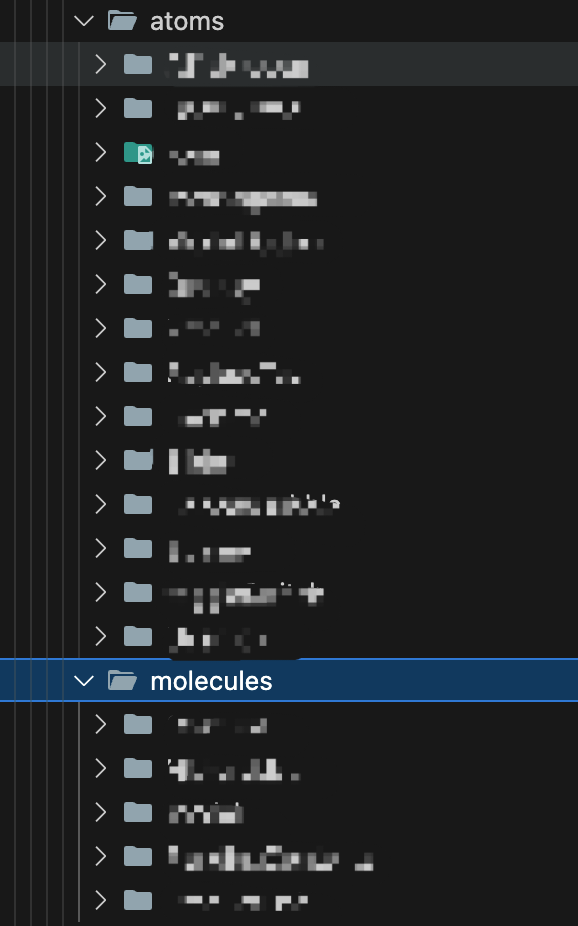

# Atomic Design Pattern 에서의 Worst Practice 경험

## Atomic Design Pattern

Atomic Design Pattern은 웹 디자인과 개발에서 사용되는 패턴 중 하나로, 다섯 가지 주요 요소를 사용하여 인터페이스를 구성한다.


Atomic Design Pattern은 원자가 모여 분자가 되고, 분자가 모여 유기체가 되는 화학적 개념을 떠올리면 이해하기 쉽다.

- Atoms (원자), Molecules (분자), Organisms (유기체), Templates (템플릿), Pages (페이지)

여기서 원자는 더이상 쪼갤 수 없는 가장 기본적인 구성 요소이며 상위 구성요소로 가며 서로 결합하며 더 큰 구성요소를 형성하는 프로세스를 통해 페이지를 완성해 나간다.  
중요한 점은 Mental Model이라는 것이다.  
https://atomicdesign.bradfrost.com/chapter-2/ 에서는 다음과 같이 설명하고 있다.

- Atomic design is not a linear process, but rather a mental model to help us think of our user interfaces as both a cohesive whole and a collection of parts at the same time.

정해진 절차가 별도로 존재하는 것이 아니라, 하기 나름이라는 것이다.  
회사의 레거시 프로젝트가 이 Atomic Design Pattern 을 따르고 있었다.

## 장점

흐름을 파악하기 편했다.

예를 들어 로그인 담당하는 페이지에서, 로그인 form 이 존재한다고 해 보자.

```tsx
return (
  <>
    // 페이지의 다른 부분들 ...
    <LoginForm />
  </>
);
```

LoginForm 을 구현부까지 들여다 볼 필요 없이 추상화 개념으로 흐름을 이해할 수 있다.

세세한 구현부는 go to definition 기능을 이용해 계층을 왔다갔다 하며 파악이 가능했다.

그리고....?

## 단점

단점이 훨씬 많았는데, 제일 먼저 생각나는 것은 중복 코드가 꽤 많이 생긴다는 것이다.

### 1. 중복 코드

Atom 컴포넌트를 잘 만들어 두고 어떻게 잘 결합시키면 중복이 적지 않을까? 라고 생각해볼 수 있다.

Atom의 컴포넌트를 살짝 수정해야 한다고 생각해보자. 단순히 수정에서 끝나는 문제가 아니다. Atom 컴포넌트가 지금 어디에서 사용되고 있는지 파악하기가 힘들다. 즉 Atom 수정이 어디까지 영향을 미칠지 모른다는 것이다. 수정으로 인해 버그가 발생했다면? 해당 Atom 컴포넌트가 사용되는 모든 컴포넌트에서 오류가 발생하게 될 것이다.

또, Organism 컴포넌트에서 살짝만 바꾼 새로운 기능을 추가하고 싶다. Organism 컴포넌트를 확장하는 게 좋을까? Organism 컴포넌트에 살짝 수정을 가한 새로운 컴포넌트를 만드는 게 좋을까?

주니어의 입장에서, 멀쩡히 잘 돌아가고 있는 코드를 수정하는 것은 굉장한 위험과 부담이 따른다. 리팩토링의 필요성에 대해 논의하던 중 사수로부터 '니가 책임질래?'라는 소리를 들으니 아무 말도 하지 못했다는 이야기를 들은 적이 있다. 그래서, Organism 컴포넌트에 살짝 수정을 가한 새로운 컴포넌트를 만드는 것에 대한 유혹에 빠지기 쉬울 것이다. 계속해서 이러한 유혹에 빠지다 보면 수정보다는 추가가 훨씬 쉽다고 느낄 것이고 Volume은 거대해질 것이다.

### 2. 접근성 저하

1번에서 지적한 문제 뿐 아니라 잘게 쪼개다 보면 Volume이 너무 거대해질 수 있다.



해당 폴더도 중복을 어느정도 줄인 후의 구조인데, 길이가 상당하다.  
atoms 가 제일 많은것도 아니고, 오히려 더 상위 레벨의 컴포넌트 수가 더 많을 수 있다.

이름만 보고 컴포넌트를 찾으려 해도, 파일의 수가 많아서 원하는 파일을 쉽게 찾지 못하는 경우가 많다. 검색 기능을 사용하더라도, 너무 많은 결과가 나와서 원하는 파일을 찾는 데 시간이 걸린다.

특히 M1 Pro 맥북을 사용함에도 불구하고 몇 초의 딜레이가 발생하는 상황은, 단순할 수 있었던 프로젝트 규모가 얼마나 비효율적으로 거대해질 수 있는지 잘 보여준다.

### 3. page 에 로직이 집중

UI를 위한 상태 관리는 해당 계층의 컴포넌트에서 이루어지지만, 핵심 비즈니스 로직은 Page 단에서 이루어지는 경우가 많았다. 결국 컴포넌트 간의 흐름은 쉽게 파악할 수 있으나, 정작 핵심 비즈니스 로직은 가독성이 너무 안 좋은 문제가 있었다.

각 컴포넌트 간의 데이터 흐름은 쉽게 파악할 수 있지만, 비즈니스 로직이 분산되지 않고 하나의 단에 집중됨으로써 코드는 복잡해지고 유지보수가 어려워졌다.

게다가, 이러한 구조에서는 비즈니스 로직의 재사용성이 떨어지게 된다. 비즈니스 로직이 특정 Page에 몰려 있기 때문에, 다른 Page나 컴포넌트에서 동일한 로직을 사용하고자 할 때 중복된 코드를 작성해야 하는 상황이 발생할 수 있다.

### 4. Prop Drilling 또는 거대한 전역 상태관리

여러 계층을 거치다 보니, Prop Drilling 이 길게 생기거나, 그걸 없애려고 전역 상태관리에 넣다보면 전역 상태가 거대해지는 문제가 있었다.

React-Query를 공부하고 난 뒤에는 전역 상태관리를 지양하는 편이라 Prop을 애용했는데, prop drilling 이 길게 생기고 prop들이 누적되니 관리도 꽤 힘들었다.

### 5. 애매모호함

Mental Model이라는 설명과 이어지는 내용인데, 개발자의 선택에 상당히 의존한다.  
Atomic Design Pattern은 각 컴포넌트를 Atoms, Molecules, Organisms로 분류하는 데 있어 명확한 규칙이 없기 때문에 개발자가 상황에 따라 적절하게 판단해야 한다.

이게 Molecules인가? Organisms인가? 이런 애매모호한 상황이 자주 발생할 수 있다.

한 개발자는 특정 컴포넌트를 Molecules로 판단할 수 있지만, 다른 개발자는 동일한 컴포넌트를 Organisms로 볼 수 있다.

이러한 차이는 또다시 유지보수를 어렵게 만든다.

### 6. 재사용하지 않는 컴포넌트까지 원자화

다른 페이지나 템플릿에서 사용되지 않는 컴포넌트임에도 불구하고 세세하게 원자화하는 경우 프로젝트 Volume 이 또 거대해진다.  
Atomic Design Pattern 의 핵심은 재사용성에 있다고 보는데, 재사용하지 않는다면 원자화하는 이유가 있을까?

재사용을 많이 해 원자화하지 않은 경우보다 원자화하는 경우의 Volume이 더 작아지는 경우엔 고려해볼 수 있겠으나 재사용성을 고려하려면 차라리 자체 UI 컴포넌트 라이브러리를 구축하는게 더 낫지 않을까 생각한다.

## 그래서 결론은..

이론적으로 완벽해 보이지만, 너무 개개인의 선택에 의존하고 있다.

개인적으로 Human Error와 같은 실수는 누구나 할 수 있고 예측하기 어렵기에 실수할 가능성을 줄이는게 근본적인 해결책이라고 생각하고 있다.

그렇기에, 개개인의 선택에 의존하는 모델은 그렇게 좋지 않은것 같다.

컴포넌트를 원자화하고 그걸 합쳐 구성할 바에 차라리 UI 라이브러리를 구축해 필요한 것들을 제공하고, 페이지에서 간단하게 2~3 계층 정도로 쪼개는게 훨씬 좋지 않을까?

어쨌든 Worst-Practice 에서 배우는 것이 훨씬 많은것 같다.

## Atomic Design 벗어나기

크기가 막 그렇게 엄청 거대하진 않아서 시간만 주어진다면 구조를 다시 정의할 수 있을것 같았다.

Pages (페이지) -> 폴더 적음.

Templates (템플릿) -> 폴더 적음.

Organisms (유기체) -> 폴더 매우많음.

Molecules (분자) -> 폴더 매우많음.

Atoms (원자) -> 폴더 많음.

위 상황이었는데, 재사용되지 않는 하위 3계층을 상위 계층 컴포넌트로 통합하는게 어떨까 싶었다.

### 1. tailwind 도입.

각 컴포넌트별로 PC, Mobile, SCSS, index 파일 4개씩 존재하는 컴포넌트도 있으므로 tailwind 를 도입해 scss파일을 사용하지 않게 하고, PC, Mobile 은 tailwind를 통해 컴포넌트 내부에서 분기를 설정하자.


컴포넌트 하나에 최대 4개까지 파일이... 있는 경우의 예시.

### 2. 사전 파악

통합하기 위해 재사용 횟수, 재사용 위치를 알 필요가 있었고, 컴포넌트 명을 통해 하나하나 찾아 정리해야 한다.

통합이라는게 거창한게 아니고, 그냥 상위 컴포넌트에 코드를 그대로 붙여넣었다.

그 이후로는 아래의 과정을 거쳤다.

### 3. Templates는 한 페이지당 하나씩 사용중(재사용하지 않음)이므로 Pages와 통합.

Templates는 재사용되는 경우가 없었다.

따라서 Templates를 별도로 관리하기보다는 이를 해당 페이지와 통합하여 관리하는 것이 더 효율적일 것이라 생각했다.

Page 컴포넌트가 거대화되는것을 막기 위해 Custom Hook을 통해 로직 일부를 분리시켰다.

No Silver Bullet.

컴포넌트를 지나치게 거대화하는것 또한 단점이 될 수 있다.

컴포넌트의 크기를 적당하게 유지하면서도, 컴포넌트 수를 줄여 접근성을 높이고 중복코드를 줄이는 것에 집중하자.

### 4. Molecules, Atoms중 재사용 되지 않으면 상위 컴포넌트로 통합.

Molecules와 Atoms는 보통 여러 곳에서 재사용되도록 설계되지만, 실제로 특정 컴포넌트 내에서만 사용되는 경우가 있었다.

상위 컴포넌트가 비대해질 가능성이 없는 것은 아니었으나, Organisms 범위에서 비대해질 로직은 딱히 존재하지 않았다.

### 5. Organisms, Molecules, Atoms중 재사용하지 않는 컴포넌트는 사용되는 Pages 내부의 components 폴더로 이동.

재사용하지 않는 컴포넌트들은 별도의 폴더에 두기보다는 해당 페이지 내부의 components 폴더로 이동시켜 접근성을 높였다.

만약 재사용하게 된다면 폴더 위치만 옮기면 될 것이다.

5단계를 거치고 나면 디렉터리 구조는 다음과 같아진다.

```
.
└── Pages/
    ├── A/
    │   ├── index.tsx
    │   └── components/
    │       └── ...
    ├── B/
    │   ├── index.tsx
    │   └── components/
    │       └── ...
    ├── C/
    │   ├── index.tsx
    │   └── components/
    │       └── ...
    └── Common/
        └── ...
```

엄청 쾌적해졌다.

Common에 컴포넌트들이 좀 많긴 한데, 이건 나중에 시도해 봐야겠다.
